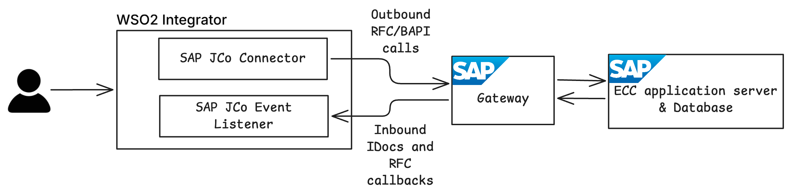
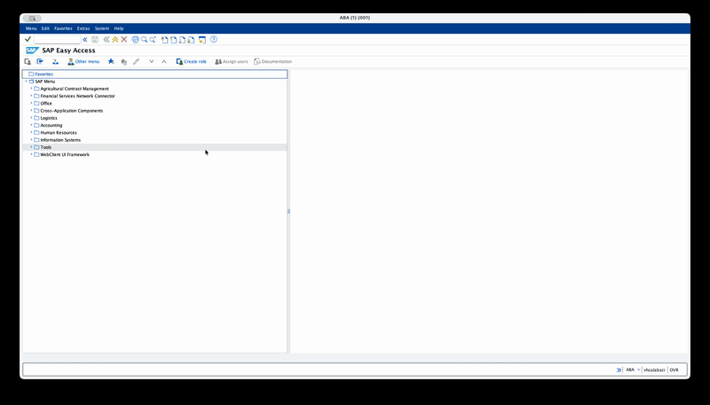
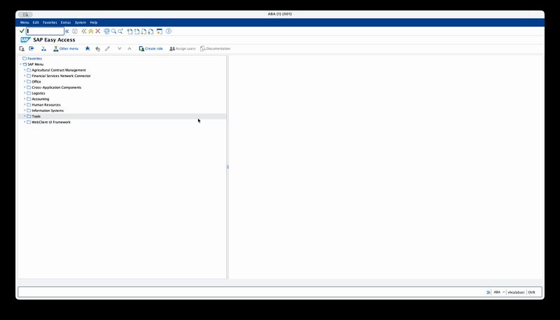
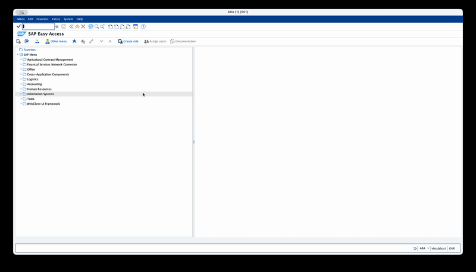

# WSO2 Integrator: Integrate with SAP ECC - Part 1 — Client Capabilities I: Executing RFCs & BAPIs on SAP ECC

## Why ECC integration still matters

A large slice of the SAP install base still runs on **ECC 6.0** (SAP ERP Central Component). Every S/4HANA migration story you read about is the happy ending to a years-long project — the reality today is that integration teams are still plumbing ECC into modern systems (e-commerce front ends, WMS, CRM, finance SaaS), and that plumbing has to keep working through the migration.

SAP S/4HANA ships OData endpoints by default. **ECC does not.** On NetWeaver the supported path for programmatic access is the **SAP Java Connector (JCo)** — a binary SDK that speaks the proprietary RFC protocol over SAP Gateway. Every other ECC-to-outside-world integration pattern you've seen (PI/PO, CPI's ECC adapter, BTP's RFC connector) is JCo under the hood.

This five-part series is about the Ballerina SAP JCo connector that wraps JCo and **WSO2 Integrator**, so you get the low-code canvas on top and typed Ballerina when you need to drop down a layer.

### Map of the series

| Part | Direction | Capability | Standard SAP object used |
|------|-----------|------------|--------------------------|
| 1 (this one) | Integrator → SAP | Call RFCs / BAPIs | `RFC_PING`, `STFC_CONNECTION`, `RFC_READ_TABLE`, `BAPI_MATERIAL_GETLIST` |
| 2 | Integrator → SAP | Send IDocs | `MATMAS03` |
| 3 | SAP → Integrator | Receive IDocs | `ORDERS05` |
| 4 | SAP → Integrator | Handle RFC callbacks | `STFC_CONNECTION` (triggered via SE37) |

Every example uses **standard, out-of-the-box SAP objects** — no custom Z-RFCs, no custom Z-IDocs, no ABAP. If you have a vanilla ECC sandbox, you can follow along.

### Mini-glossary

- **RFC (Remote Function Call)** — SAP's native RPC protocol. Every function module marked *remote-enabled* is callable over RFC.
- **BAPI (Business Application Programming Interface)** — a standardised, published RFC in the Business Object Repository. BAPIs are RFCs with a stability contract: they're the public API SAP commits to.
- **IDoc** — SAP's document-oriented EDI format. Used for asynchronous master data and document exchange (material master, sales orders, deliveries, invoices).
- **tRFC / qRFC** — Transactional / Queued RFC. Asynchronous RFC variants with at-most-once (tRFC) or in-order (qRFC) delivery guarantees. IDocs ride on tRFC by default.
- **SAP Gateway** — the TCP-level entry point into an SAP application server. External JCo servers register with the gateway using a **Program ID**.
- **Program ID** — an identifier a registered external server announces to the gateway. The SAP side references it in SM59 to route traffic outward to your external server.

### Why `ballerinax/sap.jco` + WSO2 Integrator pair well

- **Typed services** — `IDocService` and `RfcService` are first-class listener types; `onReceive` and `onCall` get strongly-typed parameters.
- **Low-code canvas on top** — drag the connector action onto a WSO2 Integrator flow, fill in the RFC name, and the Ballerina is generated for you. Flip to code when you need custom logic.
- **Typed error hierarchy** — `ConnectionError`, `LogonError`, `AbapApplicationError`, `IDocError`, `ParameterError`, `ConfigurationError`, `ExecutionError` — you route on the error *type*, not by parsing strings.
- **First-class IDoc support** — send and receive without hand-rolling XML pipelines; TID management for tRFC is handled by the connector.



---

## SAP concepts for this part

### RFC vs BAPI

Every BAPI is an RFC; not every RFC is a BAPI. Practically: if it's listed in the `BAPI` transaction (the Business Object Repository browser), you can rely on it being stable across support packages. If it's an RFC you found in SE37 that isn't a BAPI, it might still be great — but treat it as an implementation detail SAP can change.

For integration work, prefer BAPIs when one exists for the business operation you're doing.

### Import / export / table parameters

Every RFC has three categories of parameters:

- **Import** — scalars and structures you send *to* SAP.
- **Export** — scalars and structures SAP sends *back*.
- **Tables** — lists of row records. They flow both ways — you send an input table (e.g. `FIELDS` when querying `RFC_READ_TABLE`) and you read an output table (e.g. `DATA` with the results).

In `ballerinax/sap.jco`, import parameters go on `RfcParameters.importParameters`, table inputs on `RfcParameters.tableParameters`. Exports and output tables are merged into the flat return record — the connector hides the distinction on the response side so you get one record.

### Authorisations needed for the RFC user

The SAP user you log on as needs `S_RFC` authorisation for each function module you call, with `ACTVT = 16` (execute) and the function module name in `RFC_NAME`. Without it SAP returns an `AbapApplicationError` with message class `RFC_ERROR_SYSTEM_FAILURE`.

You will not normally see this for `RFC_PING` / `STFC_CONNECTION` (they're usually granted to all RFC-enabled users), but it bites on the first BAPI call. If you see auth errors, ask SAP Basis for `S_RFC` on the function group — not just the single function module.

---

## SAP-side setup

### Step 1 — Confirm or create an RFC-enabled user (SU01)

Log on to SAP GUI. Transaction **SU01**.

- **User Type** = *Dialog* (or *Communication* for service accounts — both work over RFC; *Dialog* lets you also log into SAP GUI for debugging).
- **Password** — set an initial password; change it on first logon so JCo doesn't get stuck on a forced-change prompt.
- **Roles / Profiles** tab — add a role that includes `S_RFC`. For a sandbox, `SAP_ALL` is fine; for anything else, scope it.



### Step 2 — Inspect the target function module (SE37)

Transaction **SE37** — the Function Builder.

Enter `RFC_PING` → **Display**. Tabs to skim:

- **Attributes** — confirm *Processing Type* = *Remote-Enabled Module*. If it's not, JCo can't call it.
- **Import** / **Export** / **Tables** / **Exceptions** — the function signature. These are the parameter names you'll be passing in Ballerina.

Now **F8** to test it locally from GUI. `RFC_PING` has no parameters — just press F8 on the test screen and look for the *Runtime* field populated with a microsecond count. That confirms the function module works on the SAP side before we ever bring the connector in.



> **Why this matters:** when something breaks, the first question to answer is *"is it an SAP problem or a connector problem?"* Running the function in SE37 first short-circuits that. If SE37 returns an error, your Ballerina code won't fix it.

### Step 3 — Browse BAPIs (BAPI transaction)

Transaction **BAPI** (yes, the transaction code is literally `BAPI`).

Open *Logistics - General → Logistics Basic Data → Material → GetList*. That's `BAPI_MATERIAL_GETLIST` — we'll call it at the end of this part.



---

## Pre-requisites

- WSO2 Integrator **5.0.0** or later

- Download SAP JCo JARs and native libraries from the SAP Service Marketplace. You need both the `sapjco3.jar` and the platform-specific native library (`sapjco3.dll` on Windows, `libsapjco3.so` on Linux, `libsapjco3.jnilib` on Mac). Add the relevant paths in the **Ballerina.toml** with `provided` scope so they're on the compile-time classpath but not bundled into the final artifact.

    ```toml
    [[platform.java21.dependency]]
    path = "<path-to-sapidoc3.jar>"
    groupId = "com.sap"
    artifactId = "com.sap.conn.idoc"
    version = "3.1.*"
    scope = "provided"

    [[platform.java21.dependency]]
    path = "<path-to-sapjco3.jar>"
    groupId = "com.sap"
    artifactId = "com.sap.conn.jco"
    version = "3.1.*"
    scope = "provided"
    ```
  
  The native library needs to be on the system `PATH` (Windows) or `LD_LIBRARY_PATH` (Linux) or `DYLD_LIBRARY_PATH` (Mac) at runtime so the JVM can find it.

- Configure the required minimum version of SAP JCo connector in your **Ballerina.toml**: (This is optional but recommended to avoid accidentally using an incompatible version of JCo)

    ```toml
    [[dependency]]
    org = "ballerinax"
    name = "sap.jco"
    version = "2.0.0"
    ```

- A running ECC system with the gateway reachable from your machine.

---

## Configure the connection

### Ballerina Code

```ballerina
import ballerina/log;
import ballerinax/sap.jco;

configurable jco:DestinationConfig sapConfig = ?;

final jco:Client sapClient = check new (sapConfig);
```

> **Tip:** If you want to configure any other advanced JCo destination properties on the client side, use `jco:AdvancedConfig` with the property keys as defined in the [SAP JCo documentation](https://help.sap.com/docs/SAP_SUPPLIER_RELATIONSHIP_MANAGEMENT/b48a1f828f9c4bfda67a7bbe4e466af0/aa6f27f62aec4231a2f5a6e92bf81470.html).

### Configure required parameters

Add the following to your **Config.toml**, replacing the values with your SAP system's connection details and the RFC-enabled user you set up in SU01.

| Parameter | Description |
|-----------|-------------|
| `ashost` | Application server hostname or IP address. |
| `sysnr` | System number (two digits, often "00"). |
| `jcoClient` | Client number (three digits, often "100" or "001"). |
| `user` | SAP username with RFC permissions. |
| `passwd` | Password for the SAP user. |

```toml
[sapConfig]
ashost = "sap-ecc.example.com"
sysnr = "00"
jcoClient = "100"
user = "TEST_USER"
passwd = "<your-password>"
```

---

## Example 1 — Connectivity hello-world with `RFC_PING`

`RFC_PING` takes zero parameters and returns nothing. If it doesn't error, you're connected.

### Ballerina Code

```ballerina
import ballerina/log;
import ballerinax/sap.jco;

configurable jco:DestinationConfig sapConfig = ?;

final jco:Client sapClient = check new (sapConfig);

public function main() {
    do {
        // Zero-parameter RFC. If this returns without an error, the connector is
        // wired to SAP correctly — credentials, gateway, S_RFC auth all good.
        jco:RfcRecord result = check sapClient->execute("RFC_PING");
        log:printInfo("RFC_PING successful, SAP is reachable and responding", result = result);

        check sapClient.close();
    } on fail error err {
        log:printError("Error occurred", 'error = err, errorType = (typeof err).toString());
    }
}
```

### Run the application

Console:

```
time=2026-04-22T10:09:32.133+05:30 level=INFO module=wso2/example message="RFC_PING successful, SAP is reachable and responding" result={}
```

> **Tip:** If you see an error, the type of error gives you a clue where to look. The connector raises typed errors for common failure modes — `ConnectionError`, `LogonError`, `AbapApplicationError`, etc. Check [Handling errors](#handling-errors) below for details on the error types and how to route on them.

---

## Example 2 — Typed echo with `STFC_CONNECTION`

`STFC_CONNECTION` takes an import string `REQUTEXT` and returns an export string `ECHOTEXT` plus a few metadata fields (`RFCSI_EXPORT` — server info structure). It's the canonical "does round-tripping work" RFC.

### Ballerina Code

```ballerina
import ballerina/log;
import ballerinax/sap.jco;

configurable jco:DestinationConfig sapConfig = ?;

final jco:Client sapClient = check new (sapConfig);

type EchoResponse record {|
    string ECHOTEXT;
    string RESPTEXT;
|};

public function main() returns error? {
    do {
        // Typed return — the connector coerces SAP's CHAR/STRING export parameters
        // into the fields on EchoResponse. Extra fields from SAP are ignored because
        // EchoResponse is a closed record with only the two fields we care about.
        EchoResponse result = check sapClient->execute("STFC_CONNECTION", {
            importParameters: {
                "REQUTEXT": "Hello from Ballerina"
            }
        });
        log:printInfo("RFC STFC_CONNECTION successful, SAP is reachable and responding", echoText = result.ECHOTEXT, responseText = result.RESPTEXT);

        check sapClient.close();
    } on fail error err {
        log:printError("Error occurred", 'error = err, errorType = (typeof err).toString());
    }
}

```

### Run the application

Console:

```
time=2026-04-22T11:23:42.689+05:30 level=INFO module=wso2/example message="RFC STFC_CONNECTION successful, SAP is reachable and responding" echoText="Hello from Ballerina" responseText="SAP R/3 Rel. 750   Sysid: ABA      Date: 20260422   Time: 055342   Logon_Data: 001/TEST_USER/E"
```

`ECHOTEXT` echoes exactly what you sent; `RESPTEXT` is a human-readable banner from the SAP system. Seeing both proves import parameters *and* export parameters round-trip correctly.

---

## Example 3 — Generic table read with `RFC_READ_TABLE` against `MARA`

`RFC_READ_TABLE` is the swiss-army knife for reading any SAP table generically. We'll use it to query `MARA` (the material master) — an existing table in every ECC install.

This example exercises import parameters *and* input table parameters *and* an output table in one call.

### main.bal

```ballerina
import ballerina/log;
import ballerinax/sap.jco;

configurable jco:DestinationConfig sapConfig = ?;

const FIELD_DELIMITER = "|";

type FieldMeta record {|
    string FIELDNAME;
    string OFFSET?;
    string LENGTH?;
    string TYPE?;
|};

type DataRow record {|
    string WA;
|};

type ReadTableResponse record {|
    FieldMeta[] FIELDS;
    DataRow[] DATA;
|};

final jco:Client sapClient = check new (sapConfig);

public function main() returns error? {
    do {
        // QUERY_TABLE and DELIMITER are import parameters.
        // OPTIONS (WHERE clause) and FIELDS (projection) are table parameters — inputs
        // passed as lists of row records. RFC_READ_TABLE returns the same-named tables
        // back on the way out, populated with DATA (pipe-delimited rows) and FIELDS
        // (metadata for each projected column).
        ReadTableResponse result = check sapClient->execute("RFC_READ_TABLE", {
            importParameters: {
                "QUERY_TABLE": "MARA",
                "DELIMITER": FIELD_DELIMITER,
                "ROWCOUNT": 5
            },
            tableParameters: {
                "OPTIONS": [
                    // Finished goods only. SAP's WHERE clause lives in TEXT — each row
                    // becomes one WHERE-clause line, AND-ed together.
                    {
                        "TEXT": "MTART EQ 'FERT'"
                    }
                ],
                "FIELDS": [
                    {"FIELDNAME": "MATNR"},
                    {"FIELDNAME": "MTART"},
                    {"FIELDNAME": "MBRSH"},
                    {"FIELDNAME": "MEINS"}
                ]
            }
        });
        log:printInfo("RFC_READ_TABLE successful, received data from SAP", fieldMeta = result.FIELDS, data = result.DATA);

        check sapClient.close();
    } on fail error err {
        log:printError("Error occurred", 'error = err, errorType = (typeof err).toString());
    }
}
```

### Run the application

Console:

```
time=2026-04-22T12:49:00.961+05:30 level=INFO module=wso2/example message="RFC_READ_TABLE successful, received data from SAP" fieldMeta=[{"FIELDNAME":"MATNR","OFFSET":"000000","LENGTH":"000018","TYPE":"C"},{"FIELDNAME":"MTART","OFFSET":"000019","LENGTH":"000004","TYPE":"C"},{"FIELDNAME":"MBRSH","OFFSET":"000024","LENGTH":"000001","TYPE":"C"},{"FIELDNAME":"MEINS","OFFSET":"000026","LENGTH":"000003","TYPE":"C"}] data=[{"WA":"000000000000000023|FERT|M|ST"},{"WA":"000000000000000024|FERT|M|ST"},...]
```

> **Note**:
>
> - `DATA` rows are **pipe-delimited** — you asked for the delimiter so you could split reliably. SAP pads character fields, so `.trim()` each.
> - Your four-column projection came back in the order you requested. `RFC_READ_TABLE` respects the order of rows in the `FIELDS` input table.
> - `RFC_READ_TABLE` is limited — it can't do joins and it truncates long fields (anything > 512 chars fails with `DATA_BUFFER_EXCEEDED`). For production reads, prefer a purpose-built BAPI when one exists.

---

## Example 4 — Real BAPI with `BAPI_MATERIAL_GETLIST`

This is a shipped-standard BAPI on every ECC install. It takes filter ranges (selection tables) and returns a list of materials with header information.

### Ballerina Code

```ballerina
import ballerinax/sap.jco;
import ballerina/log;

configurable jco:DestinationConfig sapConfig = ?;

type MaterialRow record {|
    string MATERIAL;
    string MATL_TYPE;
    string IND_SECTOR;
    string MATL_GROUP?;
|};

type Return record {|
    string TYPE;
    string MESSAGE;
    string CODE?;
|};

type MaterialListResponse record {|
    Return[] RETURN;
    MaterialRow[] MATNRLIST;
|};

final jco:Client sapClient = check new (sapConfig);

public function main() returns error? {
    do {
        // Ranges-style filter: the MATNRSELECTION table is a selection-option table —
        // each row specifies SIGN (I/E), OPTION (BT/EQ/...), LOW, HIGH. Here we ask for
        // materials BETWEEN 1000 and 2000, inclusive.
        MaterialListResponse result = check sapClient->execute("BAPI_MATERIAL_GETLIST", {
            importParameters: {
                "MAXROWS": 10
            },
            tableParameters: {
                "MATNRSELECTION": [
                    {
                        "SIGN": "I",
                        "OPTION": "BT",
                        "MATNR_LOW": "000000000000001000",
                        "MATNR_HIGH": "000000000000002000"
                    }
                ]
            }
        });

        // Check for explicit errors first. BAPI_MATERIAL_GETLIST only writes to RETURN
        // when there is something to report — errors, warnings, or explicit success messages.
        // An empty RETURN with populated MATNRLIST is normal: no error, here is your data.
        Return[] errors = result.RETURN.filter(r => r.TYPE == "E" || r.TYPE == "A");
        if errors.length() > 0 {
            return error("BAPI failed: " + errors[0].MESSAGE);
        }

        if result.MATNRLIST.length() == 0 {
            log:printWarn("No materials found in the given range");
            check sapClient.close();
            return;
        }

        Return[] successMsgs = result.RETURN.filter(r => r.TYPE == "S");
        Return? successMsg = successMsgs.length() > 0 ? successMsgs[0] : ();
        if successMsg is () {
            log:printInfo("BAPI executed successfully, no explicit success message returned");
            check sapClient.close();
            return;
        }

        log:printInfo("Found materials in SAP", returnMessage = successMsg?.MESSAGE, materialCount = result.MATNRLIST.length());
        foreach MaterialRow row in result.MATNRLIST {
            log:printInfo("Material found", material = row.MATERIAL, materialType = row.MATL_TYPE, industrySector = row.IND_SECTOR, materialGroup = row.MATL_GROUP);
        }

        check sapClient.close();
    } on fail error err {
        log:printError("Error occurred", 'error = err, errorType = (typeof err).toString());
    }
}
```

### What to look for

Console:

```
time=2026-04-22T14:15:27.456+05:30 level=INFO module=wso2/example message="Found materials in SAP" returnMessage="10 materials found" materialCount=10
time=2026-04-22T14:15:27.457+05:30 level=INFO module=wso2/example message="Material found" material="000000000000001234" materialType="FERT" industrySector="M" materialGroup="FG01"
...
```

> **Note:** Every BAPI returns a `RETURN` structure or `RETURN` table(for multi-message BAPIs). Always check `RETURN.TYPE` *before* you trust the rest of the response — a BAPI can return `TYPE = 'E'` with an empty result table and no ABAP exception raised. That's the contract: ABAP exceptions are for infrastructure failures (the function module itself crashed), `RETURN.TYPE = 'E'` is for business-rule failures (e.g. invalid material range).

---

## Handling errors

### Common errors

| Error message | Likely cause | SAP transaction to check |
|---------------|--------------|-------------------------|
| Connect to SAP gateway failed {"errorGroup":102,"key":"JCO_ERROR_COMMUNICATION"} | Network issue, wrong `ashost` or `sysnr`, or gateway not running | SMGW (Gateway Monitor) |
| Client XXX is not available in this system {"errorGroup":103,"key":"JCO_ERROR_LOGON_FAILURE"} | Wrong `jcoClient` (client number) | SU01 (User Maintenance) — check the client number for your user |
| Name or password is incorrect (repeat logon) {"errorGroup":103,"key":"JCO_ERROR_LOGON_FAILURE"} | Wrong `user` or `passwd` | SU01 (User Maintenance) — check the username and password |
| RFC function 'XXX' not found in SAP | Wrong function name in `execute` call | SE37 (Function Builder) — check the function module name and spelling |

### Application errors

All four examples return `error?` at the main level, but in WSO2 Integrator flows you'll want to fork on error type. The connector raises one of these:

| Error type | When |
|------------|------|
| `ResourceError` | JCo connection pool exhausted |
| `SystemError` | SAP system failure (rollback, shortdump) |
| `AbapApplicationError` | ABAP exception raised by the function module (includes `abapMsgClass`, `abapMsgNumber`, etc.) |
| `ParameterError` | Ballerina ↔ JCo type conversion failed (e.g. you sent a `string` into an SAP `INT4`) |
| `ConfigurationError` | Client not initialised, closed, destination ID collision |

Pattern-match with `if result is ConnectionError` / `is AbapApplicationError` branches. The `AbapApplicationError` detail gives you structured access to the ABAP message — `abapMsgClass`, `abapMsgNumber`, `abapMsgV1..V4` — so you can route on the specific message without parsing the human-readable string.

```ballerina
do {
    jco:Client sapClient = check new (sapConfig);
    MaterialListResponse|error result = sapClient->execute("BAPI_MATERIAL_GETLIST", { ... });
} on fail error err {
    if err is jco:AbapApplicationError {
        jco:AbapApplicationErrorDetail detail = err.detail();
        io:println("ABAP error ", detail.abapMsgClass ?: "?", "-", detail.abapMsgNumber ?: "?");
        return;
    }
    if err is jco:ConnectionError {
        // retry later — SAP gateway is down
        return;
    }
}
```

---
