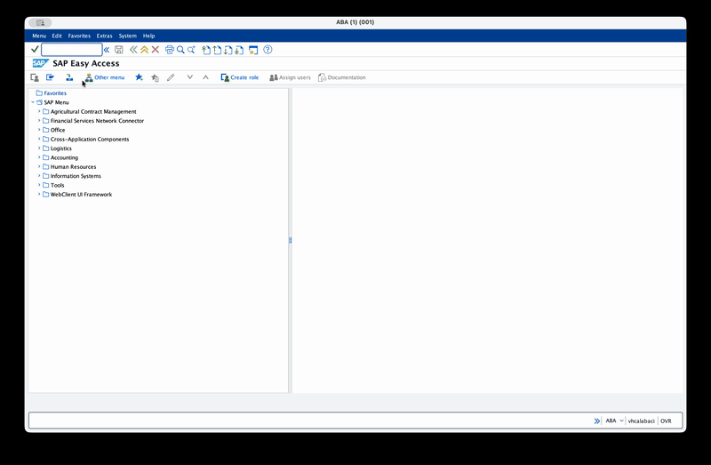
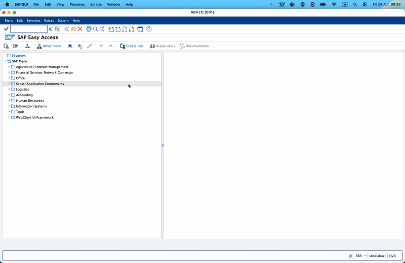
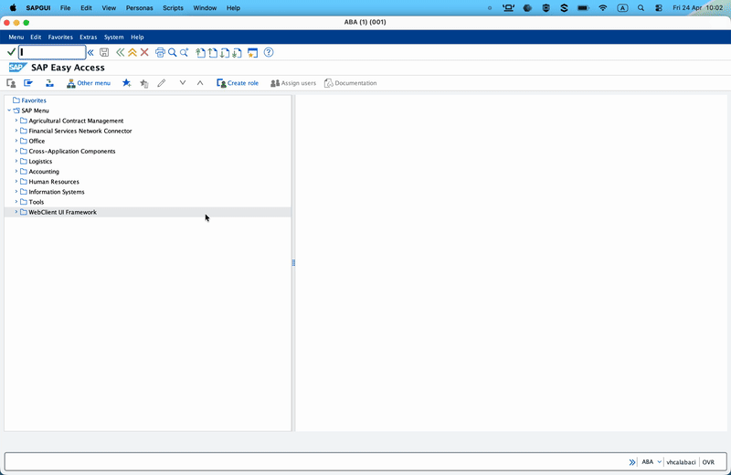
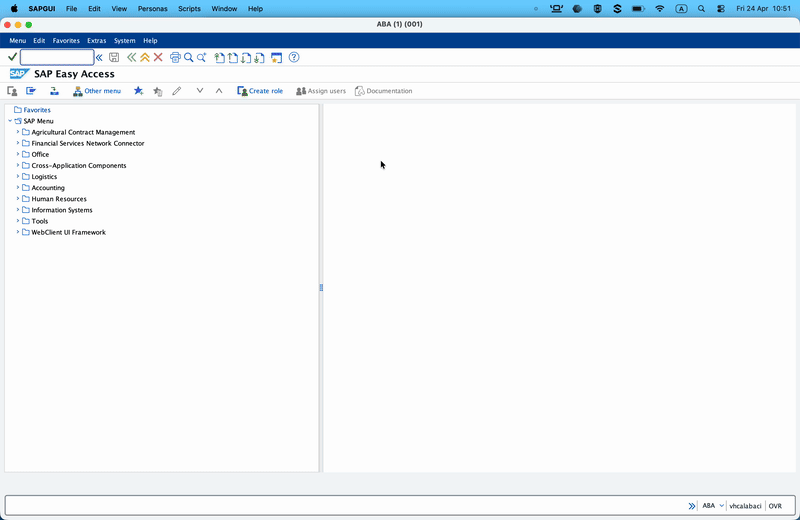
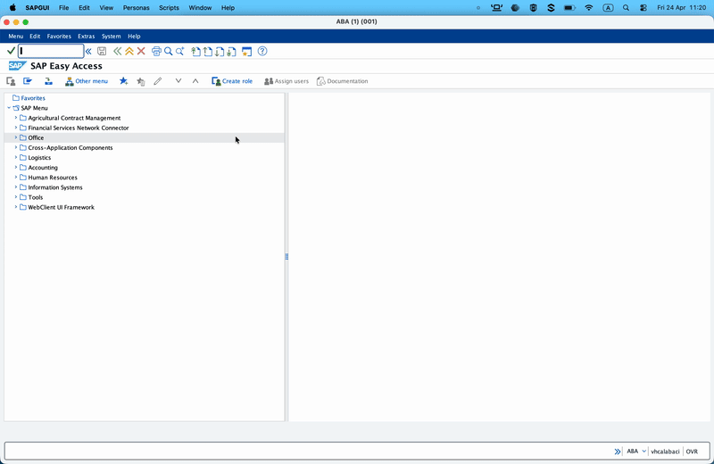
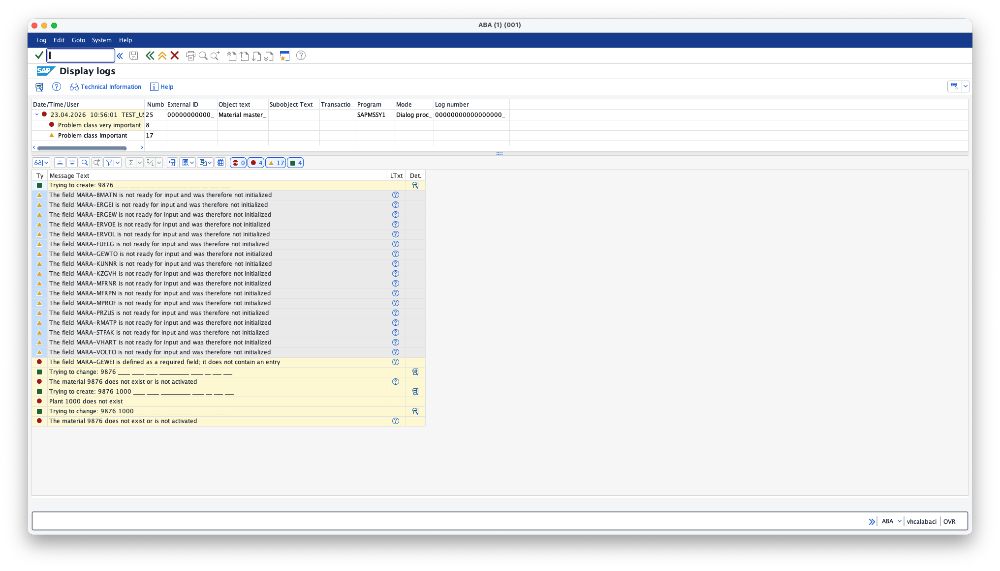
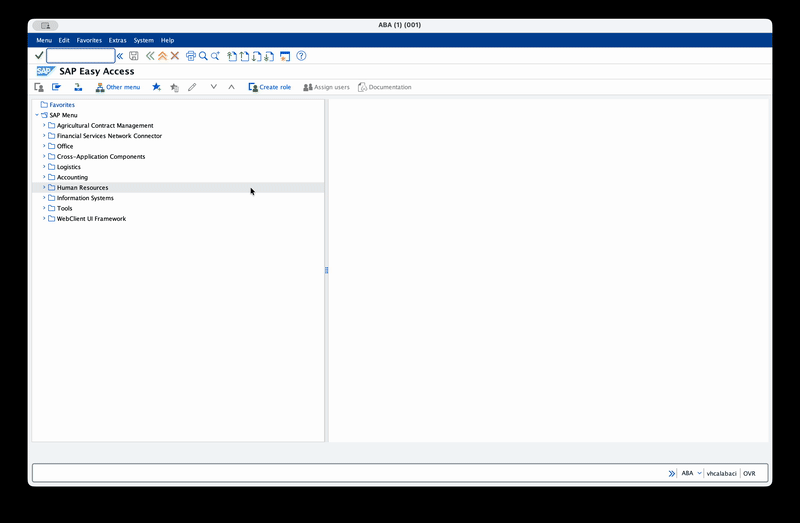

# Ballerina: Integrate with SAP ECC - Part 2 — Client Capabilities II: Sending IDocs to SAP ECC

> Part two of the series. Part 1 covered synchronous RFCs and BAPIs. This part covers the **asynchronous** side of outbound integration: sending IDocs into SAP.

---

## Why IDocs instead of a BAPI?

BAPIs are synchronous — you call, SAP processes, you get a result (or an error) before your flow moves on. That's great for read-path operations and for business flows where you need immediate confirmation. But SAP's *native* document exchange format — the one every partner system, EDI broker, and third-party connector speaks — is the **IDoc**.

IDocs are:

- **Asynchronous.** You hand them off; SAP queues them for processing. Processing can run seconds or hours later.
- **Exactly-once.** Delivery rides on **tRFC** (transactional RFC), which uses a TID (Transaction ID) to guarantee SAP processes each IDoc exactly once even if the transport retries.
- **Document-oriented.** One IDoc = one business document (one material, one sales order, one delivery). The structure is self-describing — control record + data records + status records.
- **Standardised.** SAP ships hundreds of standard IDoc types. For master data the most common are `MATMAS03` (material master), `DEBMAS07` (customer master), and `ADRMAS03` (address master). For transactional data: `ORDERS05`, `DELVRY03`, `INVOIC02`.

For any high-volume master-data sync or event-driven flow, IDocs are what you reach for.

---

## SAP concepts

### IDoc anatomy

Every IDoc is three kinds of record wrapped together:

- **Control record** (`EDI_DC40`) — the envelope. Says what type of IDoc this is (`IDOCTYP`, `MESTYP`), who's sending it (`SNDPRT`, `SNDPRN`), who's receiving it (`RCVPRT`, `RCVPRN`), and a document number (`DOCNUM`).
- **Data records** — one or more segments carrying the payload. Material master, for example, has `E1MARAM` (client-level basic data), `E1MARCM` (plant-level), `E1MAKTM` (short texts), each with nested sub-segments.
- **Status records** — appended *by SAP* during processing, not sent by you. You read them afterwards in WE02/WE05 to see what happened.

### Standard IDoc types covered in the series

| Type | Purpose | Part |
|------|---------|------|
| `MATMAS03` | Material master | Part 2 (this one) |
| `DEBMAS07` | Customer master | Part 5 |
| `ORDERS05` | Purchase order | Part 3 |
| `DELVRY03` | Outbound delivery | Part 5 |
| `INVOIC02` | Invoice / billing document | Part 5 |

### tRFC — and why IDocs use it

When the connector calls `sendIDoc`, under the hood JCo does this:

1. Generate a **TID** (24-hex-char Transaction ID). Unique per IDoc send.
2. Call `IDOC_INBOUND_ASYNCHRONOUS` on SAP with the TID and the IDoc XML.
3. SAP writes the IDoc to the database, bound to that TID.
4. Confirm the TID back to JCo. JCo marks it confirmed.
5. If the confirm fails (network blip between step 3 and 4), JCo retries the whole send with the *same TID* — SAP recognises it, skips the duplicate, and confirms.

That's the exactly-once guarantee. You don't have to implement it.

The Ballerina SAP JCo connector manages TIDs internally. You can supply your own TID to `sendIDoc` for idempotency across process restarts (e.g. if you persist the outbound intent before calling the connector), but for most flows the connector-generated TID is the right default.

### Partner profile — the SAP side has to agree

Before SAP will accept an IDoc from your external program, someone with access to WE20 has to configure an **inbound partner profile** declaring:

- *Partner number* — the logical identifier for your external system.
- *Message type* — e.g. `MATMAS`.
- *Process code* — the ABAP function module that processes the inbound IDoc (e.g. `MATM` for material master).
- *Partner type* — usually `LS` (logical system).

No partner profile → SAP rejects the IDoc immediately with status `56` (*IDoc with errors added*).

---

## SAP-side setup

### Step 1 — Create or verify logical systems (BD54, then SCC4)

Before creating a WE20 partner profile of type `LS`, make sure the logical systems exist and are assigned correctly.

- Transaction **BD54**: create (or verify) logical systems for sender (for example, `TEST_LS`) and receiver (for example, `ABACLNT001`).



- Transaction **SCC4**: verify the current client is assigned to the correct local logical system of the receiver.

- Keep names consistent with the IDoc control record values (`SNDPRN` / `RCVPRN`).

### Step 2 — Inbound partner profile (WE20) for sender

Transaction **WE20**.

- Left panel → *Partner Type LS → Logical Systems* → double-click your partner (or create one: e.g. `TEST_LS`).
- **Inbound parameters** → **Create inbound parameter** (the `+` icon).
- Fill in:
  - *Message type* = `MATMAS`
  - *Process code* = `MATM`
  - *Trigger immediately* (radio) — gives you immediate processing for easier debugging.
- Save.



### Step 3 — Know where to look afterwards (WE02 / WE05)

Transaction **WE02** (or `WE05` — same data, different default filter). This is the IDoc monitor. After you send an IDoc you'll look it up here to confirm it arrived.

Key status codes:

| Code | Meaning | What it tells you |
|------|---------|-------------------|
| `64` | IDoc ready to be transferred to the application | Reached SAP, scheduled for processing |
| `62` | IDoc passed to application | Application function module called |
| `53` | Application document posted | ✅ End-to-end success |
| `51` | Application document not posted | Reached SAP, but the application (e.g. MM material posting) rejected it |
| `56` | IDoc with errors added | Partner profile missing/wrong |
| `29` | Error in ALE service | Configuration issue — not a connector fault |

**For the purposes of this part, the success bar is "IDoc reaches SAP" — i.e. it shows up in WE02 with a control record.** A `53` is a bonus.



### Step 4 — Optional: Inspect IDoc type documentation (WE60)

Transaction **WE60**. Enter `MATMAS03` → Documentation. SAP generates a nicely-formatted doc listing every segment, every field, with types and the original ABAP data element description. It's the authoritative reference for building a valid payload.



> **Tip:** If you want to create the relevant IDoc type in Ballerina as a record type instead of working with raw XML, you can download the IDoc structure as an XSD file and use Ballerina XSD tool to generate the relevant types. The `sendIDoc` action still accepts raw XML, you can convert the record value to XML and pass it to the action.

---

## Pre-requisites

- Ballerina **2201.13.3** or later

- Download SAP JCo JARs and native libraries from the SAP Service Marketplace. You need both the `sapjco3.jar` and the platform-specific native library (`sapjco3.dll` on Windows, `libsapjco3.so` on Linux, `libsapjco3.jnilib` on Mac). Add the relevant paths in the **Ballerina.toml** with `provided` scope so they're on the compile-time classpath but not bundled into the final artifact.

    ```toml
    [[platform.java21.dependency]]
    path = "<path-to-sapidoc3.jar>"
    groupId = "com.sap"
    artifactId = "com.sap.conn.idoc"
    version = "3.1.*"
    scope = "provided"

    [[platform.java21.dependency]]
    path = "<path-to-sapjco3.jar>"
    groupId = "com.sap"
    artifactId = "com.sap.conn.jco"
    version = "3.1.*"
    scope = "provided"
    ```
  
  The native library needs to be on the system `PATH` (Windows) or `LD_LIBRARY_PATH` (Linux) or `DYLD_LIBRARY_PATH` (Mac) at runtime so the JVM can find it.

- Configure the required minimum version of SAP JCo connector in your **Ballerina.toml**: (This is optional but recommended to avoid accidentally using an incompatible version of JCo)

    ```toml
    [[dependency]]
    org = "ballerinax"
    name = "sap.jco"
    version = "2.0.0"
    ```

- A running ECC system with the gateway reachable from your machine, and an RFC-enabled user with `S_RFC` for `RFC_PING`.

---

## Configure the connection

### Ballerina Code

```ballerina
import ballerina/log;
import ballerinax/sap.jco;

configurable jco:DestinationConfig sapConfig = ?;

final jco:Client sapClient = check new (sapConfig);
```

> **Tip:** If you want to configure any other advanced JCo destination properties on the client side, use `jco:AdvancedConfig` with the property keys as defined in the [SAP JCo documentation](https://help.sap.com/docs/SAP_SUPPLIER_RELATIONSHIP_MANAGEMENT/b48a1f828f9c4bfda67a7bbe4e466af0/aa6f27f62aec4231a2f5a6e92bf81470.html).

### Configure required parameters

Add the following to your **Config.toml**, replacing the values with your SAP system's connection details and the RFC-enabled user you set up in SU01.

| Parameter | Description |
|-----------|-------------|
| `ashost` | Application server hostname or IP address. |
| `sysnr` | System number (two digits, often "00"). |
| `jcoClient` | Client number (three digits, often "100" or "001"). |
| `user` | SAP username with RFC permissions. |
| `passwd` | Password for the SAP user. |

```toml
[sapConfig]
ashost = "sap-ecc.example.com"
sysnr = "00"
jcoClient = "100"
user = "TEST_USER"
passwd = "<your-password>"
```

---

## Send a `MATMAS03` IDoc

We will build a minimal but valid `MATMAS03` payload: one material header (`E1MARAM`), one language description (`E1MAKTM`). That's the smallest "real" material master you can send.

### Example IDoc XML

```xml
<?xml version="1.0" encoding="UTF-8"?>
<MATMAS03>
  <IDOC BEGIN="1">
    <EDI_DC40 SEGMENT="1">
      <TABNAM>EDI_DC40</TABNAM>
      <MANDT>100</MANDT>
      <DIRECT>2</DIRECT>
      <IDOCTYP>MATMAS03</IDOCTYP>
      <MESTYP>MATMAS</MESTYP>
      <SNDPOR>SAPDEV</SNDPOR>
      <SNDPRT>LS</SNDPRT>
      <SNDPRN>TEST_LS</SNDPRN>
      <RCVPOR>SAPDEV</RCVPOR>
      <RCVPRT>LS</RCVPRT>
      <RCVPRN>ABACLNT001</RCVPRN>
    </EDI_DC40>
    <E1MARAM SEGMENT="1">
      <MSGFN>005</MSGFN>
      <MATNR>000000000000009876</MATNR>
      <MTART>FERT</MTART>
      <MBRSH>M</MBRSH>
      <MEINS>ST</MEINS>
      <GEWEI>KGM</GEWEI>
      <E1MAKTM SEGMENT="1">
        <MSGFN>005</MSGFN>
        <SPRAS>E</SPRAS>
        <MAKTX>Integrator Demo Material</MAKTX>
        <SPRAS_ISO>EN</SPRAS_ISO>
      </E1MAKTM>
    </E1MARAM>
  </IDOC>
</MATMAS03>
```

A few notes on that payload:

- `MSGFN = 005` means *create*. `004` would be *delete*, `018` *update*.
- `DIRECT = 2` means *inbound* (from SAP's point of view — we're sending it *to* SAP).
- `MANDT = 100` must match your target SAP client.
- `SNDPRN` / `RCVPRN` must match the logical systems you set up in WE20.

### Ballerina Code

```ballerina
import ballerina/io;
import ballerinax/sap.jco;

configurable jco:DestinationConfig sapConfig = ?;

public function main() returns error? {
    jco:Client sapClient = check new (sapConfig);

    xml iDoc = check io:fileReadXml("resources/material.xml");

    // sendIDoc defaults to IDocType DEFAULT (standard tRFC transport).
    // The connector creates a TID, calls IDOC_INBOUND_ASYNCHRONOUS, and confirms.
    // On success, the IDoc is persisted on SAP's side — application processing
    // happens asynchronously after we return.
    check sapClient->sendIDoc(iDoc);
    io:println("IDoc sent. Check WE02 on SAP side.");

    check sapClient.close();
}
```

### Run the application

Console:

```text
IDoc sent. Check WE02 on SAP side.
```

### Inspecting status records after the send

Then SAP GUI:

1. Transaction **WE02**.
2. Filter: *Basic type = MATMAS03*, *Date = today*, *Direction = 2 (inbound)*.
3. Execute (F8).
4. The top row is your IDoc. Double-click it.



Status records are SAP's story of what it did with your IDoc. In WE02, click **Status records** in the detail tree.

```
01  IDoc generated
30  IDoc ready for dispatch (ALE service)
64  IDoc ready to be transferred to the application
62  IDoc passed to application
53  Application document posted
```

Every IDoc with a happy path ends on `53`. If you see `51` or `56` further down, you'll also see a human-readable `STATUSMSG` describing the application error.

## Handling Ballerina side errors

### Common errors

| Error message | Likely cause | SAP transaction to check |
|---------------|--------------|-------------------------|
| Connect to SAP gateway failed {"errorGroup":102,"key":"JCO_ERROR_COMMUNICATION"} | Network issue, wrong `ashost` or `sysnr`, or gateway not running | SMGW (Gateway Monitor) |
| Client XXX is not available in this system {"errorGroup":103,"key":"JCO_ERROR_LOGON_FAILURE"} | Wrong `jcoClient` (client number) | SU01 (User Maintenance) — check the client number for your user |
| Name or password is incorrect (repeat logon) {"errorGroup":103,"key":"JCO_ERROR_LOGON_FAILURE"} | Wrong `user` or `passwd` | SU01 (User Maintenance) — check the username and password |
| RFC function 'XXX' not found in SAP | Wrong function name in `execute` call | SE37 (Function Builder) — check the function module name and spelling |

### Application errors

All four examples return `error?` at the main level, but in Ballerina flows you'll want to fork on error type. The connector raises one of these:

| Error type | When |
|------------|------|
| `ResourceError` | JCo connection pool exhausted |
| `SystemError` | SAP system failure (rollback, shortdump) |
| `AbapApplicationError` | ABAP exception raised by the function module (includes `abapMsgClass`, `abapMsgNumber`, etc.) |
| `ParameterError` | Ballerina ↔ JCo type conversion failed (e.g. you sent a `string` into an SAP `INT4`) |
| `ConfigurationError` | Client not initialised, closed, destination ID collision |

Pattern-match with `if result is ConnectionError` / `is AbapApplicationError` branches. The `AbapApplicationError` detail gives you structured access to the ABAP message — `abapMsgClass`, `abapMsgNumber`, `abapMsgV1..V4` — so you can route on the specific message without parsing the human-readable string.

```ballerina
do {
    jco:Client sapClient = check new (sapConfig);
    MaterialListResponse|error result = sapClient->execute("BAPI_MATERIAL_GETLIST", { ... });
} on fail error err {
    if err is jco:AbapApplicationError {
        jco:AbapApplicationErrorDetail detail = err.detail();
        io:println("ABAP error ", detail.abapMsgClass ?: "?", "-", detail.abapMsgNumber ?: "?");
        return;
    }
    if err is jco:ConnectionError {
        // retry later — SAP gateway is down
        return;
    }
}
```

### Troubleshooting common SAP-side errors

Testing IDocs against an SAP Sandbox or a system heavily modified by add-ons rarely works on the first try. Here are the most common errors you will encounter and exactly how to fix them.

#### 1. Error: "Inbound partner profile does not exist" (Status 56)

Even if you configured everything perfectly in WE20, SAP might still throw this error.

The Fix: Partner Profiles are client-dependent. Look closely at your XML payload's `<MANDT>` tag (e.g., 100). If your SAP GUI is logged into client 001, SAP cannot see the profile you created. Ensure the `<MANDT>` in your XML and the jcoClient in your Ballerina config perfectly match the client number where WE20 was configured.

#### 2. Error: "Function module not allowed" (Status 51) / The Add-on Hijack

Sometimes you send a MATMAS05 IDoc, but SAP complains about custom namespaces like /GBT/MATMAS05.

What's happening: When the connector asks SAP for the IDoc blueprint, SAP add-ons (like Global Batch Traceability) can intercept the request and force the connector to use a custom schema wrapper. SAP's internal registry (WE57) then rejects the IDoc because the standard function module isn't authorized for the custom /GBT/ namespace.

The Fix (The Version Downgrade Trick): Instead of fighting SAP's registry, simply change your XML root node and IDOCTYP to an older version like MATMAS03. Add-ons typically only hijack the latest versions. By downgrading, SAP hands the connector the standard, unmodified blueprint, bypassing the add-on entirely.

#### 3. Error: "Application document not posted" (Status 51)

This means your connector did its job perfectly—the data reached SAP! However, SAP's business rules rejected the payload.

The Fix: In WE02, expand the Status records folder and click on the lines with the red circle icon. Look at the text at the bottom of the screen.

```
"The field MARA-GEWEI is defined as a required field": Add the missing tag (e.g., `<GEWEI>KGM</GEWEI>`).

"Plant 1000 does not exist": Your sandbox is missing basic factory data. Simply remove the Plant segment (`<E1MARCM>`) from your XML so SAP only creates the global basic data.
```



---

## Variants — tRFC vs qRFC via the `IDocType` enum

The `sendIDoc` action accepts an `iDocType` parameter controlling the transport protocol:

```ballerina
public enum IDocType {
    DEFAULT                     // "0" — IDoc default (tRFC, IDoc v3 where supported)
    VERSION_2                   // "2"
    VERSION_3                   // "3" — IDoc v3 over tRFC
    VERSION_3_IN_QUEUE          // "Q" — outbound qRFC queue
    VERSION_3_IN_QUEUE_VIA_QRFC // "I" — inbound qRFC queue
}
```

### When to use which

- **`DEFAULT` / `VERSION_3`** — standard tRFC. Use for all master data and independent documents. Ordering across sends is not guaranteed.
- **`VERSION_3_IN_QUEUE_VIA_QRFC`** — qRFC into a named inbound queue. Use when ordering matters. Requires a `queueName`. Example: a sequence of `MATMAS` updates for the same material where order matters (header update → extension), or a run of `DELVRY03` notifications that must process in shipping order.

Example:

```ballerina
// Ordered sends into a named inbound queue. SAP processes all IDocs in this queue
// strictly in the order JCo delivered them. If one fails, the queue stops at the
// failure — fix it in SMQ2 on the SAP side, then the queue resumes.
check sapClient->sendIDoc(
    iDoc,
    iDocType = jco:VERSION_3_IN_QUEUE_VIA_QRFC,
    queueName = "TEST_QUEUE_I"
);
```

On the SAP side, inspect queued IDocs in **SMQ2** (inbound qRFC monitor).



---

## Supplying your own TID for end-to-end idempotency

If you persist the outbound intent *before* calling `sendIDoc` (e.g. write to an outbox table, then send), you can pass the outbox row's ID as the TID:

```ballerina
check sapClient->sendIDoc(iDoc, tid = outboxRowId);
```

If your process crashes after writing the outbox row but before SAP confirms, the retry reuses the same TID. SAP's tRFC bookkeeping (`ARFCRSTATE`) recognises the TID as already processed and returns success without duplicating.

This is usually only worth wiring when you have at-least-once semantics upstream and need exactly-once into SAP end-to-end. For most Ballerina flows the connector-generated TID is fine.

---
