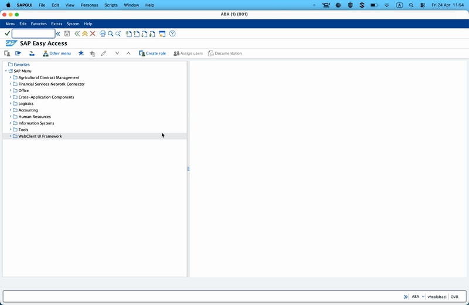
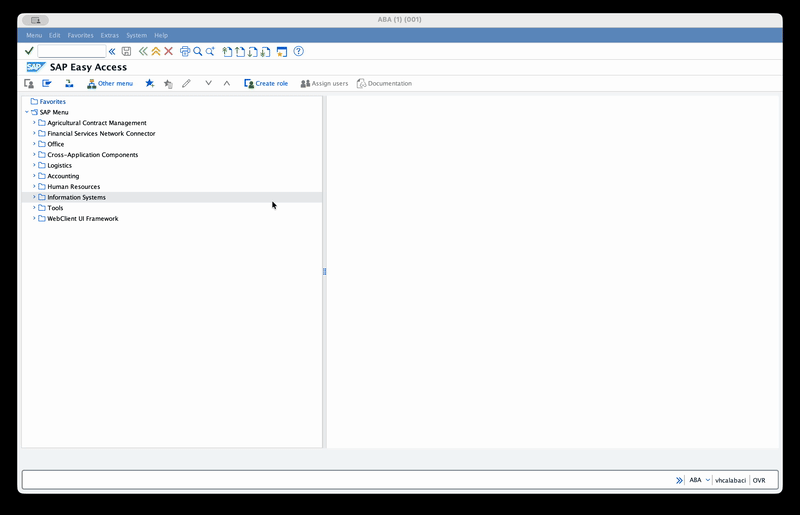
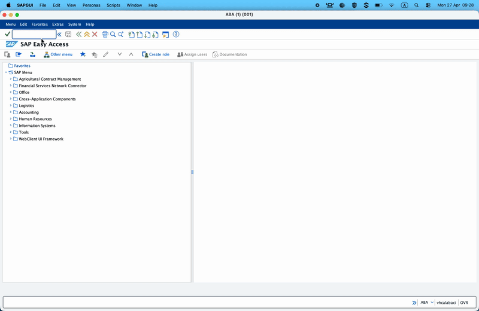
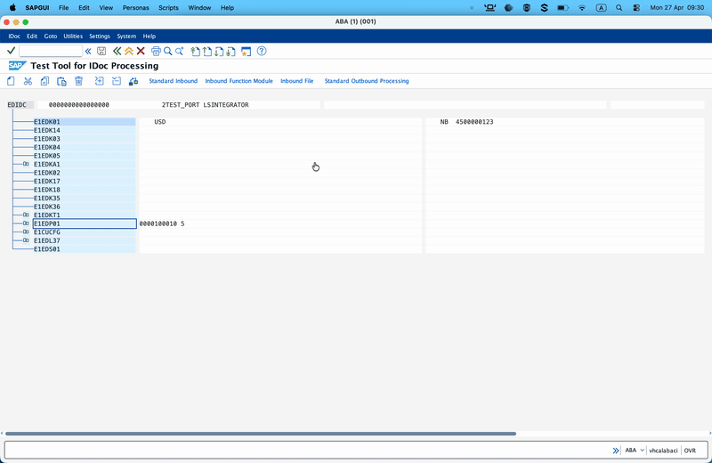
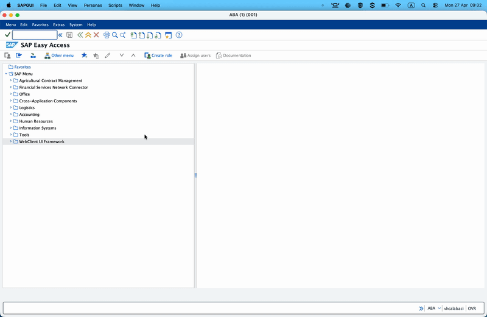

# WSO2 Integrator: Integrate with SAP ECC - Part 3 — Listener Capabilities I: Receiving IDocs from SAP ECC

> Parts 1 and 2 were Integrator → SAP. From here on, the arrows flip: SAP pushes into your Integrator flow.

---

## What we're building

A WSO2 Integrator service that registers itself as a **JCo server** with SAP Gateway. When SAP dispatches an `ORDERS05` IDoc outbound (e.g. a purchase order sent to a supplier), it lands on our `IDocService` as an XML payload, which we parse and forward to a downstream system.

**Success criterion:** trigger an outbound `ORDERS05` from WE19, watch `onReceive` fire with valid XML, log the purchase order number and line items.

---

## SAP concepts

### Registered server programs vs started programs

When SAP needs to call an external system, there are two flavours of SM59 TCP/IP destination:

- **Started Program** — SAP starts the external binary on demand. Legacy. Requires SAP to have shell access to the host running the program. Don't.
- **Registered Server Program** — the external program starts independently, *registers* itself with SAP Gateway under a **Program ID**, and waits for traffic. This is what Ballerina JCo Listener does.

The Program ID is the string the server announces at registration time (e.g. `TEST_LISTENER`). SAP looks up *where to send outbound traffic* by matching this Program ID against what's configured in SM59.

### SAP Gateway and its ACL

Gateway ACLs (`reginfo` and `secinfo`) gate which external programs can register. Without a matching entry in `reginfo` the gateway silently drops your registration — from your listener's perspective, it looks like a hanging connection. This is the common pitfall when setting up a listener for the first time.

- **`reginfo`** — who can register as what Program ID from which host.
- **`secinfo`** — who can launch which started programs (not relevant for registered servers, but the file has to exist).

### Outbound partner profile

Mirror image of Part 2's inbound partner profile. The SAP side now has to decide to **send** the IDoc:

- Partner number (the receiver logical system — your integration system).
- Message type (e.g. `ORDERS`).
- Basic type (e.g. `ORDERS05`).
- Receiver port — the WE21 port that points to the SM59 destination that matches your Program ID.

---

## SAP-side setup

There are five transactions involved. Do them in order.

### Step 1 — Create the SM59 destination

Transaction **SM59**.

- Right-click *TCP/IP connections* → *Create* (or press `Ctrl+F8`).
- **RFC Destination** = `TEST_LISTENER` (memorable name — does not have to match the Program ID, but convention is to make them equal).
- **Connection Type** = `T` (TCP/IP).
- **Description** = *Integrator Test listener*.
- Enter.
- **Technical Settings** tab → **Activation Type** = *Registered Server Program*.
- **Program ID** = `TEST_LISTENER` — this is what the Ballerina listener will use in `ServerConfig.progid`.
- **Gateway Options** → set **Gateway Host** and **Gateway Service** (usually `sapgw<sysnr>` where `<sysnr>` is your SAP system number, e.g. `sapgw00`).
- Save.


### Step 2 — Open the Gateway ACL

Transaction **SMGW**.

- *Goto* → *Expert Functions* → *External Security* → *Maintain ACL Files*.
- Edit **reginfo**. Add above any deny-all rule at the bottom:

```
P TP=TEST_LISTENER HOST=* ACCESS=* CANCEL=*
```

- Save.
- *Reload ACL Files* (this is critical — SAP does *not* hot-reload it).


> **Sandbox shortcut:** `HOST=*` and `ACCESS=*` make life easy for blog-demo purposes. In real environments you pin the host to the IPs of your Integrator nodes.

### Step 3 — Create the IDoc port (WE21)

Transaction **WE21**.

- *Transactional RFC* (in the left tree) → right-click → *Create*.
- **Port** = `TEST_PORT` (or let SAP auto-number).
- **RFC destination** = `TEST_LISTENER` (the SM59 destination we just made).
- Save.



### Step 4 — Create or verify logical systems (BD54, then SCC4)

Before creating a outbound partner profile of type `LS`, make sure the outbound logical systems exist and assigned correctly.

Transaction **BD54**:

- create (or verify) logical systems for outbound (for example, `INTEGRATOR`).



### Step 5 — Outbound partner profile (WE20)

Transaction **WE20**.

- Partner Type LS → the logical system representing your Integrator instance.
- **Outbound parameters** → **Create** (the `+` icon).
- Fill in:
  - **Message Type** = `ORDERS`
  - **Receiver port** = the WE21 port from step 3 (e.g. `TEST_PORT`).
  - **Output mode** = *Pass IDocs Immediately* (for easy testing — in production, you'd batch).
  - **IDoc Type** → **Basic type** = `ORDERS05`.
- Save.


### Step 6 — Have an IDoc to send (WE19)

Transaction **WE19** is an IDoc test tool. If your sandbox already has some `ORDERS05` IDocs in `WE02`, pick one and use *Via IDoc* mode in WE19 to resend it. If not, you can seed one:

- WE19 → *Create from scratch* → *Basic type* = `ORDERS05` → pick a template.
- Fill the control record fields:
  - Receiver:
    - Port: TEST_PORT (the WE21 port we made)
    - Partner No: the logical system you used in the partner profile (e.g. `INTEGRATOR`)
    - Partner Type: LS
  - Sender:
    - Partner No: Any valid sender partner or reuse the same logical system (e.g. `INTEGRATOR`)
    - Partner Type: LS or whatever matches your sender partner configuration
  - Logical Message Type:
    - Message Type: `ORDERS`
- Add one `E1EDK01` (order header) segment and one `E1EDP01` (line item) segment. Example values:
  - **E1EDK01**: `BELNR=4500000123`, `CURCY=USD`, `BSART=NB`
  - **E1EDP01**: `POSEX=000010`(Document item), `QUALF=001`(Action), `MENGE=5`(Quantity), `PSTYP=0`(Item category), `MATNR=MAT_123`(Material number).
- Save — but **don't send yet**. We want the Ballerina listener running first.



---

## Pre-requisites

- WSO2 Integrator **5.0.0** or later

- Download SAP JCo JARs and native libraries from the SAP Service Marketplace. You need both the `sapjco3.jar` and the platform-specific native library (`sapjco3.dll` on Windows, `libsapjco3.so` on Linux, `libsapjco3.jnilib` on Mac). Add the relevant paths in the **Ballerina.toml** with `provided` scope so they're on the compile-time classpath but not bundled into the final artifact.

    ```toml
    [[platform.java21.dependency]]
    path = "<path-to-sapidoc3.jar>"
    groupId = "com.sap"
    artifactId = "com.sap.conn.idoc"
    version = "3.1.*"
    scope = "provided"

    [[platform.java21.dependency]]
    path = "<path-to-sapjco3.jar>"
    groupId = "com.sap"
    artifactId = "com.sap.conn.jco"
    version = "3.1.*"
    scope = "provided"
    ```
  
  The native library needs to be on the system `PATH` (Windows) or `LD_LIBRARY_PATH` (Linux) or `DYLD_LIBRARY_PATH` (Mac) at runtime so the JVM can find it.

- Configure the required minimum version of SAP JCo connector in your **Ballerina.toml**: (This is optional but recommended to avoid accidentally using an incompatible version of JCo)

    ```toml
    [[dependency]]
    org = "ballerinax"
    name = "sap.jco"
    version = "2.0.0"
    ```

- A running ECC system with the gateway reachable from your machine.

---

## Configure the Ballerina listener

### Ballerina Code

```ballerina
import ballerinax/sap.jco;

configurable jco:ServerConfig sapConfig = ?;

listener jco:Listener idocListener = new (sapConfig);
```

> **Tip:** If you want to configure any other advanced JCo server/client properties on the listener side, use `jco:AdvancedConfig` with the property keys as defined in the [SAP JCo documentation](https://help.sap.com/docs/SAP_SUPPLIER_RELATIONSHIP_MANAGEMENT/b48a1f828f9c4bfda67a7bbe4e466af0/aa6f27f62aec4231a2f5a6e92bf81470.html).

### Configure required parameters

Add the following to your **Config.toml**, replacing the values with your SAP system's connection details and credentials.

| Parameter | Description |
|-----------|-------------|
| `gwhost` | The hostname or IP address of the SAP Gateway. This is typically the same as your SAP application server. |
| `gwserv` | The gateway service name, usually in the format `sapgwXX` where `XX` is your SAP system number (e.g. `sapgw00`). |
| `progid` | The Program ID that your listener will register under. This must match the Program ID configured in your SM59 destination. |
| `connectionCount` | The number of concurrent connections the listener will register with the gateway. Start with `2` for testing; increase if you expect high volume. |
| `repositoryDestination` | The destination used by the listener to fetch IDoc segment metadata from SAP. This is required for the listener to render incoming IDocs as XML with the correct field types. You can either specify inline credentials or reference an existing destination defined with a SAP JCo client. |

```toml
[sapConfig]
gwhost = "sap-ecc.example.com"
gwserv = "sapgw00"
progid = "TEST_LISTENER"
connectionCount = 2

[sapConfig.repositoryDestination]
ashost = "sap-ecc.example.com"
sysnr = "00"
jcoClient = "100"
user = "RFCUSER"
passwd = "<your-password>"
lang = "EN"
```

---

## Implement the service to handle incoming IDocs

### Implement ORDERS05 type

A minimal projection that gets the fields we care about and lets the connector ignore the rest:

```ballerina
type EDI_DC40 record {|
    string SNDPRT?;
    string SNDPRN?;
    string RCVPRT?;
    string RCVPRN?;
    string IDOCTYP?;
    string MESTYP?;
    string DOCNUM?;
|};

type E1EDK01 record {|
    string BELNR?;    // customer purchase order number
    string CURCY?;    // currency
    string BSART?;    // order type
|};

type E1EDP01 record {|
    string POSEX?;    // line item number
    string MENGE?;    // quantity
    string MATNR?;    // material number
    string PSTYP?;    // item category
|};

type IDOC record {|
    EDI_DC40 EDI_DC40;
    E1EDK01 E1EDK01;
    E1EDP01[] E1EDP01;
|};

type ORDERS05 record {|
    IDOC IDOC;
|};
```

> **Tip:** You can download the IDoc structure as an XSD file and use Ballerina XSD tool to generate the relevant types.

### Ballerina Code

```ballerina
import ballerina/data.xmldata;
import ballerina/log;
import ballerinax/sap.jco;

configurable jco:ServerConfig sapConfig = ?;

listener jco:Listener idocListener = new (sapConfig);

service jco:IDocService on idocListener {

    remote function onReceive(xml iDoc) returns error? {
        if iDoc.length() < 2 {
            log:printWarn("Received empty IDoc, skipping");
            return;
        }
        xml iDocElement = iDoc.get(1);
        if iDocElement !is xml:Element {
            log:printWarn("Received invalid IDoc format, skipping");
            return;
        }
        string idocType = iDocElement.getName();
        if idocType != "ORDERS05" {
            log:printWarn("Received unsupported IDoc type, skipping", idocType = idocType);
            return;
        }

        ORDERS05 'order = check xmldata:parseAsType(iDoc);

        string poNumber = 'order.IDOC.E1EDK01.BELNR ?: "<unknown>";
        int lineCount = 'order.IDOC.E1EDP01.length();

        log:printInfo("Received purchase order",
                poNumber = poNumber,
                lineCount = lineCount,
                sender = 'order.IDOC.EDI_DC40.SNDPRN
        );

        // Forward to downstream WMS, OMS, queue, etc. — omitted here for brevity.
        // Any error this function explicitly returns is LOGGED by the connector, not routed
        // to onError (IDoc delivery is fire-and-forget ).
    }

    remote function onError(error err) returns error? {
        log:printError("Error occurred", 'error = err, errorType = (typeof err).toString());
    }
}
```

| Available Methods | Description |
|-------------------|-------------|
| `onReceive(xml iDoc)` | Called for every incoming IDoc. The payload is the fully-rendered IDoc XML. You can parse it with `xmldata:parseAsType` into a typed record. Any error returned from this function is logged by the connector but does not affect SAP's delivery status (IDoc delivery is fire-and-forget). |
| `onError(error err)` | Called for framework-level errors such as JCo gateway errors, registration failures, ACL denials, connection retries, and IDoc rendering errors. Does NOT fire for errors returned from `onReceive`. |

### Start the listener and Test on SAP side

At this point, SMGW on the SAP side should show a registered server.


Also test the RFC destination in SM59 — it should succeed now that the listener is up.


### Send an IDoc from SAP

Back to WE19 → the IDoc you prepped earlier → **Standard outbound processing** (F5, or *IDoc → Start outbound processing*). This triggers the normal partner-profile dispatch path — SAP looks up `INTEGRATOR`'s outbound parameters for `ORDERS` + `ORDERS05`, routes to the WE21 port, which points to the SM59 destination, which points to your Program ID.



Integrator console:

```
time=2026-04-27T09:30:46.609+05:30 level=INFO module=wso2/example message="Received purchase order" poNumber="4500000123" lineCount=1 sender="INTEGRATOR"
```

WE02 on the SAP side shows the IDoc with outbound status `03` (*Data passed to port OK*) or `12` (*Dispatch OK*) — either is success.



---

## Troubleshooting common SAP-side errors

### Gateway ACL blocking the handshake

By far the most common "my listener isn't receiving anything" cause. Symptoms:

- The listener starts clean but never shows up in SMGW.
- `onError` fires with a message like `registration of tp TEST_LISTENER from host <ip> not allowed`.

Fix: the ACL entry in `reginfo` (SMGW step above). Don't forget the *Reload ACL Files* step — editing the file without reloading changes nothing.

### Listener starts before the gateway handshake completes

`jco:Listener.start()` returns immediately. The actual handshake with SAP Gateway happens *asynchronously* on JCo's connection threads. If the gateway is unreachable when `start()` returns, JCo retries behind the scenes and delivers each failure to `onError`. Once the gateway comes back, JCo reconnects silently and the errors stop. **No listener restart is needed.**

This is why `onError` is the primary signal for connectivity problems — not the return of `start()`.

### `connectionCount` tuning

`ServerConfig.connectionCount` controls how many concurrent JCo server threads register under your Program ID. Practical guidance:

- **Default `2`** — fine for blog demos and low-volume inbound flows.
- **Bump to 5–10** if you're the receiver for a high-volume IDoc stream (master data sync, nightly finance postings).
- SAP-side concurrency matters too — your gateway has a limit per Program ID. Check with Basis before setting anything above 10.

```toml
connectionCount = 5
```

### `repositoryDestination` — what it does and when you need it

When SAP sends an IDoc to your listener, the payload arrives as *raw* JCo segments — field names but not field types. To render valid XML, the listener has to call back into SAP and ask "what are the types for segments in `ORDERS05`?" That callback needs SAP credentials — which is `repositoryDestination`.

Two ways to supply it:

**Option A — inline credentials** (what we did above; simpler for a first setup):

```toml
[sapConfig.repositoryDestination]
ashost = "..."
user = "..."
# ... etc
```

**Option B — reuse an existing Client's destination**:

```ballerina
jco:Client rfcClient = check new (clientConfig, destinationId = "ECC_DEV");

// In ServerConfig: repositoryDestination = "ECC_DEV" (a string now, not a record)
```

Use Option B when your flow *also* runs outbound RFCs — one destination serves both directions, halving the number of logon sessions on SAP.

If you leave `repositoryDestination` out, `ServerConfig` won't compile. It's required.

---

## Errors routed to `onError`

`onError` is narrower than you might expect — it gets:

- **Framework errors from JCo itself.** Gateway disconnects during a retry. Server registration failures (permission denied by ACL). IDoc rendering errors (the repository lookup failed or returned unexpected metadata).
- **Pre-dispatch failures.** The XML rendering of an incoming IDoc failed before `onReceive` could be called.

It does **not** get errors from `onReceive` itself. Your `onReceive` returning an error is logged at WARN, but not surfaced to `onError`. The rationale: IDoc delivery is fire-and-forget from SAP's perspective — there's no caller waiting for you to return. Anything your code does with the IDoc (parse it, forward it) is your responsibility to handle locally.

The RfcService in the next part is different — it *does* have a caller waiting, and errors from `onCall` surface back to SAP as ABAP exceptions. But for IDoc: log locally, handle locally.

---
