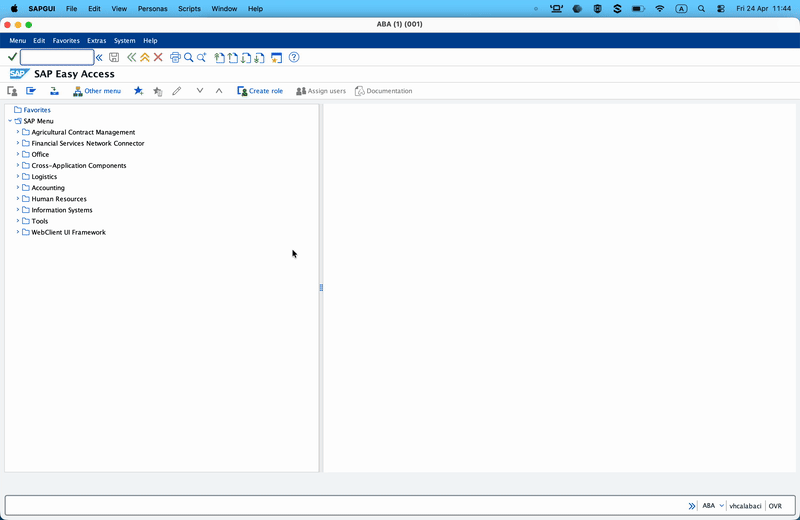
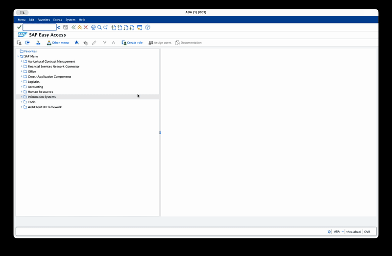
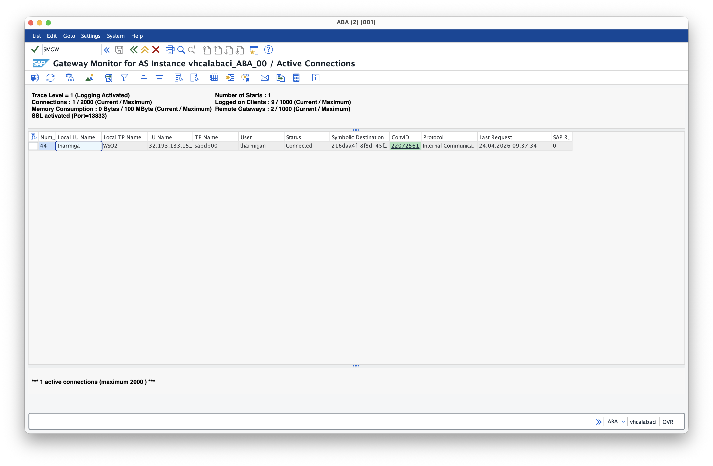
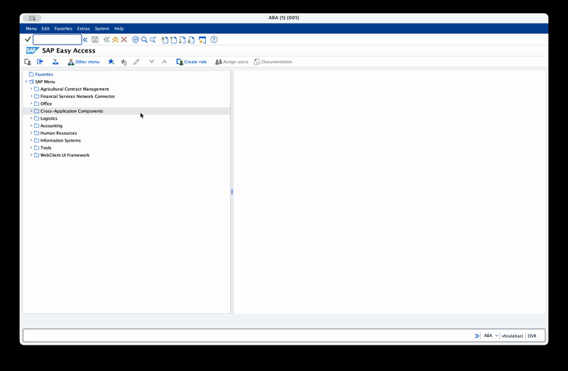
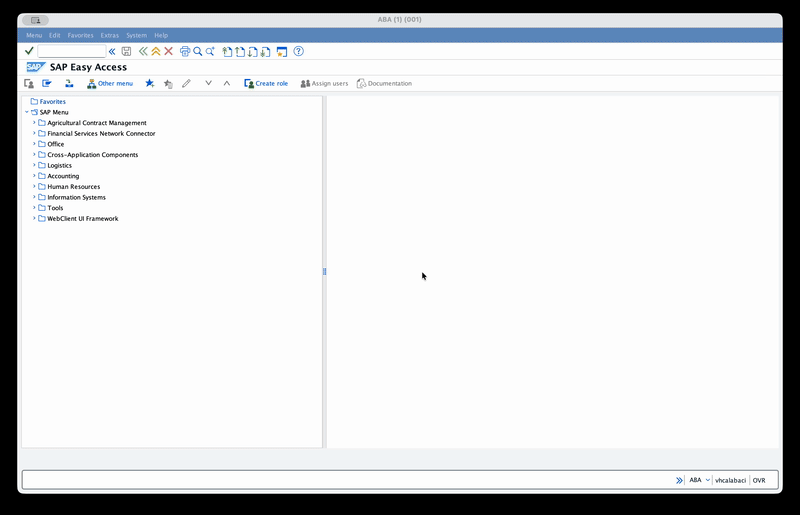

# Ballerina: Integrate with SAP ECC - Part 4 — Listener Capabilities II: Handling RFC Callbacks from SAP ECC

> Part 3 was asynchronous inbound (IDocs). This one is synchronous inbound: SAP calls *your* Ballerina service over RFC and waits for a response.

---

## What we're building

A Ballerina service that registers on SAP Gateway as a **server**, announces a Program ID, and responds to inbound RFC calls as if it were a local SAP function module. The example function is `STFC_CONNECTION` — a shipped-standard signature, so we don't need any ABAP.

**Success criterion:** in SE37 on the SAP side, set *RFC target sys* to our SM59 destination, execute `STFC_CONNECTION` with `REQUTEXT = "Hello Ballerina"`, and see `ECHOTEXT` come back populated by the Ballerina service.

---

## Framing — synchronous inbound RFC in the real world

In production, inbound RFCs are almost always **application-triggered**:

- A **BAdI** (Business Add-In) fires during a standard SAP transaction (VA01 for sales order create, ME21N for purchase order create, etc.) and calls your external credit-check / pricing / inventory service.
- A **user exit** in a customer-modified transaction.
- A **Z-program** run from a job scheduler.

All three are application-layer triggers — they're customer-specific and require ABAP to wire up. **For the blog we keep the example pure-standard** by triggering the call from **SE37** against the SM59 destination. SE37 lets you point any function module at an RFC target — so when you execute `STFC_CONNECTION` in SE37 with *RFC target sys* set, SAP makes an outbound call to that destination using the `STFC_CONNECTION` signature, and our Ballerina listener receives it.

The *mechanism* your listener sees is identical whether SAP was triggered by a BAdI or by SE37. The example is representative.

---

## SAP concepts

### Synchronous RFC vs asynchronous tRFC/qRFC

| Aspect | Synchronous RFC | tRFC / qRFC |
|---|---|---|
| Caller waits? | Yes | No |
| Return value? | Yes, any type | No |
| Error semantics | Exception returns to caller | IDoc status records, requeue for retry |
| Used for | Credit checks, pricing, inventory, validation | Master data sync, document exchange |
| Typical payload | Small (< 100KB) | Up to IDoc size (MB range) |

This part is all about **synchronous**. SAP is blocked while our service runs, so latency matters — keep processing fast, fail loudly.

### How SAP resolves the function signature

When SAP calls `STFC_CONNECTION` on our Ballerina server, the payload arrives with parameter *names* but not *types*. JCo has to ask "what's the type of `REQUTEXT`?" — and it does that by calling back into SAP's function module repository via the `repositoryDestination` we configured in `ServerConfig`.

This is the same `repositoryDestination` from Part 3 — it plays the same role for RFC as for IDoc: a lookup channel back into SAP's metadata store.

### Real-world use cases for RFC callbacks

- **Credit check during sales order create.** BAdI `BADI_SD_SALES_BASIC` fires in VA01; your external credit service decides whether the order proceeds. Covered in Part 5.
- **Pricing lookup.** Pricing user exits (`USEREXIT_NEW_PRICING_VBKD` and friends) call out to a pricing engine for custom price lists.
- **Inventory availability.** Calling an external WMS during order entry before SAP commits to quantities.
- **Tax calculation.** External tax service (Vertex, Avalara) called during billing.

All of them BAdI/exit-triggered in production. All of them look identical from the Ballerina side.

---

## SAP-side setup

The SM59 + SMGW setup is **identical to Part 3** — register a TCP/IP destination with a Program ID, punch a hole in the gateway ACL. If you already did that for the IDoc listener, you can reuse the same Program ID or create a new one for separation. This walkthrough assumes a fresh destination dedicated to the RFC service.

### Step 1 — Create the SM59 destination

Transaction **SM59**.

- Right-click *TCP/IP connections* → *Create* (or press `Ctrl+F8`).
- **RFC Destination** = `TEST_LISTENER` (memorable name — does not have to match the Program ID, but convention is to make them equal).
- **Connection Type** = `T` (TCP/IP).
- **Description** = *Integrator Test listener*.
- Enter.
- **Technical Settings** tab → **Activation Type** = *Registered Server Program*.
- **Program ID** = `TEST_LISTENER` — this is what the Ballerina listener will use in `ServerConfig.progid`.
- **Gateway Options** → set **Gateway Host** and **Gateway Service** (usually `sapgw<sysnr>` where `<sysnr>` is your SAP system number, e.g. `sapgw00`).
- Save.




### Step 2 — Open the Gateway ACL

Transaction **SMGW**.

- *Goto* → *Expert Functions* → *External Security* → *Maintain ACL Files*.
- Edit **reginfo**. Add above any deny-all rule at the bottom:

```text
P TP=TEST_LISTENER HOST=* ACCESS=* CANCEL=*
```

- Save.
- *Reload ACL Files* (this is critical — SAP does *not* hot-reload it).



> **Sandbox shortcut:** `HOST=*` and `ACCESS=*` make life easy for blog-demo purposes. In real environments you pin the host to the IPs of your Ballerina nodes.

### Step 3 — Confirm the SAP RFC user has `S_RFC` for the callable function modules

The Ballerina side receives whatever SAP sends — but the SAP user invoking SE37 needs execute auth on `STFC_CONNECTION`. Normally granted to all RFC users; worth checking if you see auth errors in SE37.

---

## Pre-requisites

- Ballerina **2201.13.3** or later

- Download SAP JCo JARs and native libraries from the SAP Service Marketplace. You need both the `sapjco3.jar` and the platform-specific native library (`sapjco3.dll` on Windows, `libsapjco3.so` on Linux, `libsapjco3.jnilib` on Mac). Add the relevant paths in the **Ballerina.toml** with `provided` scope so they're on the compile-time classpath but not bundled into the final artifact.

    ```toml
    [[platform.java21.dependency]]
    path = "<path-to-sapidoc3.jar>"
    groupId = "com.sap"
    artifactId = "com.sap.conn.idoc"
    version = "3.1.*"
    scope = "provided"

    [[platform.java21.dependency]]
    path = "<path-to-sapjco3.jar>"
    groupId = "com.sap"
    artifactId = "com.sap.conn.jco"
    version = "3.1.*"
    scope = "provided"
    ```
  
  The native library needs to be on the system `PATH` (Windows) or `LD_LIBRARY_PATH` (Linux) or `DYLD_LIBRARY_PATH` (Mac) at runtime so the JVM can find it.

- Configure the required minimum version of SAP JCo connector in your **Ballerina.toml**: (This is optional but recommended to avoid accidentally using an incompatible version of JCo)

    ```toml
    [[dependency]]
    org = "ballerinax"
    name = "sap.jco"
    version = "2.0.0"
    ```

- A running ECC system with the gateway reachable from your machine.

---

## Configure the Ballerina listener

### Ballerina Code

```ballerina
import ballerinax/sap.jco;

configurable jco:ServerConfig sapConfig = ?;

listener jco:Listener rfcListener = new (sapConfig);
```

> **Tip:** If you want to configure any other advanced JCo server/client properties on the listener side, use `jco:AdvancedConfig` with the property keys as defined in the [SAP JCo documentation](https://help.sap.com/docs/SAP_SUPPLIER_RELATIONSHIP_MANAGEMENT/b48a1f828f9c4bfda67a7bbe4e466af0/aa6f27f62aec4231a2f5a6e92bf81470.html).

### Configure required parameters

Add the following to your **Config.toml**, replacing the values with your SAP system's connection details and credentials.

| Parameter | Description |
|-----------|-------------|
| `gwhost` | The hostname or IP address of the SAP Gateway. This is typically the same as your SAP application server. |
| `gwserv` | The gateway service name, usually in the format `sapgwXX` where `XX` is your SAP system number (e.g. `sapgw00`). |
| `progid` | The Program ID that your listener will register under. This must match the Program ID configured in your SM59 destination. |
| `connectionCount` | The number of concurrent connections the listener will register with the gateway. Start with `2` for testing; increase if you expect high volume. |
| `repositoryDestination` | The destination used by the listener to fetch function module metadata from SAP. This should point to a valid SM59 destination with credentials that can log in and access the function modules you expect to be called (e.g. `STFC_CONNECTION`). |

```toml
[sapConfig]
gwhost = "sap-ecc.example.com"
gwserv = "sapgw00"
progid = "TEST_LISTENER"
connectionCount = 2

[sapConfig.repositoryDestination]
ashost = "sap-ecc.example.com"
sysnr = "00"
jcoClient = "001"
user = "TEST_USER"
passwd = "<your-password>"
lang = "EN"
```

## Implement the service to handle the RFC calls

### Ballerina Code

```ballerina
import ballerina/log;
import ballerinax/sap.jco;

configurable jco:ServerConfig sapConfig = ?;

listener jco:Listener rfcListener = new (sapConfig);

service jco:RfcService on rfcListener {

    remote function onCall(string functionName, jco:RfcParameters parameters)
            returns jco:RfcRecord|error? {

        log:printInfo("RFC call received", functionName = functionName, importParams = parameters.importParameters, tableParams = parameters.tableParameters);

        if functionName != "STFC_CONNECTION" {
            return error(string `Unsupported function module: ${functionName}`);
        }
        jco:RfcRecord imports = parameters.importParameters ?: {};
        string requestText = (imports["REQUTEXT"] ?: "").toString();

        // STFC_CONNECTION's export parameters are:
        //   ECHOTEXT — echoes REQUTEXT
        //   RESPTEXT — a banner identifying the responding system
        // The connector maps fields in the returned RfcRecord 1:1 to the export
        // parameters by name.
        return {
            "ECHOTEXT": requestText,
            "RESPTEXT": "Responded by Integrator"
        };
    }

    remote function onError(error err) returns error? {
        log:printError("Error occurred", 'error = err, errorType = (typeof err).toString());
    }
}
```

| Available Methods | Description |
|-------------------|-------------|
| `onCall(string functionName, RfcParameters parameters) returns RfcRecord\|xml\|error?` | Fires for every inbound RFC call. `functionName` is the name of the invoked function module (e.g. `STFC_CONNECTION`). `parameters` contains the import parameters and any tables. The return value is serialized back to SAP as the export parameters. Returning an `error` surfaces to SAP as an ABAP exception. |
| `onError(error err) returns error?` | Fires for framework-level errors (gateway disconnects, registration failures, parameter unmarshalling failures before dispatch, response serialization failures after return). Errors returned by `onCall` do NOT trigger this — they round-trip to SAP as exceptions. |

### Start the listener and Test on SAP side

At this point, SMGW on the SAP side should show a registered server.



With the listener running, go back to SM59 → your `TEST_LISTENER` destination → **Connection Test** (`Ctrl+F3`).

You should see a "Connection Test: TEST_LISTENER" output with *Result = OK* and round-trip timing. SAP is now confirmed to reach your server.



### Trigger an RFC call from SAP

This is where the part's purpose comes together.

Transaction **SE37**.

- **Function Module** = `STFC_CONNECTION`.
- **Test / Execute** (`F8`).
- On the test screen, **do not press F8 again yet.** Click *Function modules → Test with RFC connection* (or set *RFC target sys* at the top — the field appears on the test screen).
- **RFC target sys** = `TEST_LISTENER` (the SM59 destination you set up).
- Fill import parameters:
  - **REQUTEXT** = `Hello Ballerina` (or any string you like).
- **F8**.



Ballerina console:

```log
time=2026-04-27T11:20:02.844+05:30 level=INFO module=wso2/example message="RFC call received" functionName="STFC_CONNECTION" importParams={"REQUTEXT":"HELLO BALLERINA"} tableParams=
```

SE37 response screen:

```text
ECHOTEXT = Hello Ballerina
RESPTEXT = Responded by Ballerina
```

That round-trip is the success criterion for this part. SAP asked a function module called `STFC_CONNECTION` for an echo, and got one — except the function module lives in a Ballerina service, not in SAP.

---

## Variant — returning raw XML instead of `RfcRecord`

`onCall`'s return type is `RfcRecord|xml|error?`. When you have the response as XML already (e.g. you fetched it from a downstream service that returns XML, or you want full control of the wire format), return it directly:

```ballerina
service jco:RfcService on rfcListener {
    remote function onCall(string functionName, jco:RfcParameters parameters)
            returns xml|error? {
        if functionName != "STFC_CONNECTION" {
            return error("Unsupported: " + functionName);
        }
        string requestText = (parameters.importParameters["REQUTEXT"] ?: "").toString();

        // Raw XML must match the SAP export-parameter structure. The connector
        // doesn't validate it against the function signature — JCo rejects it
        // downstream if the shape is wrong.
        return xml `<STFC_CONNECTION>
            <ECHOTEXT>${requestText}</ECHOTEXT>
            <RESPTEXT>Responded by Integrator (xml path)</RESPTEXT>
        </STFC_CONNECTION>`;
    }

    remote function onError(error err) returns error? {
        log:printError("Error occurred", 'error = err, errorType = (typeof err).toString());
    }
}
```

Trade-off:

- **`RfcRecord`** — connector handles type coercion, field mapping, table serialization. Recommended default.
- **`xml`** — you have total control; useful when you need to return something whose shape the connector can't easily infer (e.g. dynamic structures). You're responsible for matching the export signature exactly.

---

## How errors flow back to SAP

Returning `error` from `onCall`:

```ballerina
return error("Customer not found: " + customerId);
```

On the SAP side, SE37 shows a **system exception** banner with your error message. If the caller was ABAP, it can catch the exception:

```abap
CALL FUNCTION 'STFC_CONNECTION'
    DESTINATION 'TEST_LISTENER'
    EXPORTING REQUTEXT = 'Hello'
    IMPORTING ECHOTEXT = lv_echo
    EXCEPTIONS system_failure = 1 MESSAGE lv_msg
               communication_failure = 2 MESSAGE lv_msg.
IF sy-subrc <> 0.
    WRITE: / lv_msg.   " "Customer not found: 42"
ENDIF.
```

**Errors from `onCall` do not fire `onError`** — they round-trip to the SAP caller. Only framework failures (JCo parameter unmarshalling before dispatch, response serialization failures after return, gateway disconnects) surface to `onError`.

That asymmetry matters: think of `onCall` as a synchronous service boundary — exceptions cross it; framework issues go to the sideband.

---

## `repositoryDestination` — why it matters more here

Part 3 needed `repositoryDestination` for IDoc segment types. RFC is the same but stricter: `onCall` *cannot* fire until the connector has resolved the function signature. If `repositoryDestination` is misconfigured — wrong credentials, unreachable SAP — the listener starts, registers, and then `onError` fires the first time SAP calls in with something like:

```
Unable to retrieve function module metadata for STFC_CONNECTION: Logon failed
```

Always verify the repository destination works *before* expecting `onCall` to fire. The easiest check: point a separate `jco:Client` at the same credentials and run `RFC_PING` (Part 1 example 1). If that works, the repository lookup will work.

---

## Troubleshooting common SAP-side errors

### `onCall` timeout

SAP's RFC client has a hard timeout (default 60s; configurable per call via `SET_RFC_TIMEOUT`). If your `onCall` takes longer, SAP raises `SYSTEM_FAILURE` on the caller and your response is discarded when it eventually arrives. For anything that *might* be slow, push the real work behind the scenes and return a fast "accepted" response, then publish the result via a downstream channel.

### Concurrency — `connectionCount` is a ceiling

`connectionCount` caps how many inbound RFC calls your listener handles concurrently. If SAP sends a burst of 10 calls and `connectionCount = 2`, eight wait in JCo's queue until a slot frees up. Calls past the queue depth fail to the SAP caller with a gateway error.

For high-volume callbacks (BAdI-triggered on every sales-order save), size this realistically.

### Function module must exist in SAP's repository

When SAP calls out to your server with `STFC_CONNECTION`, it's really sending "here are the types defined for STFC_CONNECTION on *my* side" — your server renders from that metadata. So the function module has to exist *in the SAP repository* even though the implementation lives on your side. For shipped-standard names like `STFC_CONNECTION`, this is fine. If you want to advertise a totally custom name, you create a shell function module in SE37 on the SAP side (signature only — no implementation) to give SAP something to look up. In production, most callback endpoints piggyback on existing shipped names or shell function modules created by the project team.

---
